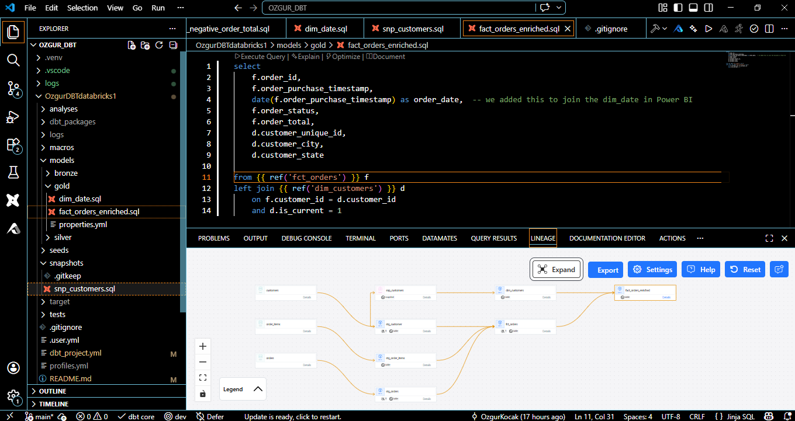
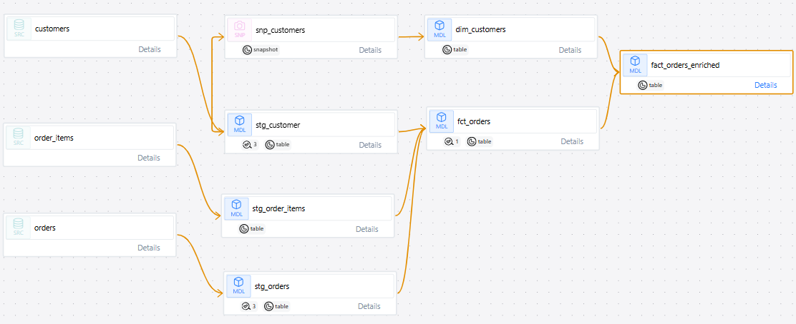
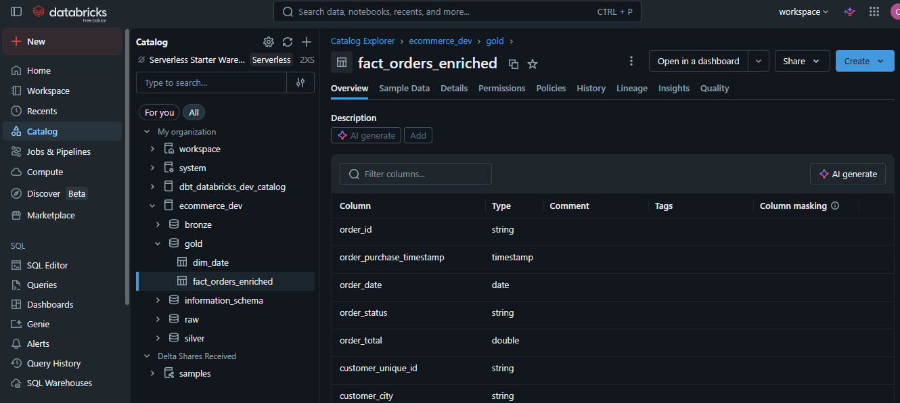
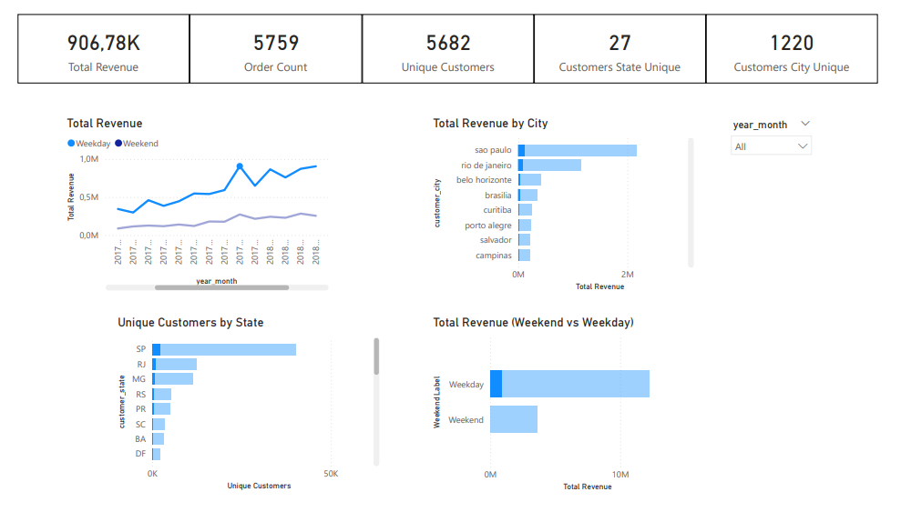

# End-to-End Data Analytics Project (dbt + Databricks + Power BI)

## Overview

This project demonstrates an end-to-end modern data stack workflow using dbt (Core), Databricks, and Power BI.

The goal is to transform raw e-commerce data into a structured, analytics-ready model and deliver business insights through an interactive dashboard.

---

## Tech Stack

* dbt Core (CLI, open-source)
* Databricks Community Edition (free)
* Power BI (data visualization)
* Git (version control)

---

## Data Source

Dataset: Brazilian E-Commerce Public Dataset by Olist (Kaggle)

This dataset contains:

* customer data
* orders
* order items
* payments
* product information

It is widely used for analytics and modeling scenarios.

---

## Project Architecture

The project follows the Medallion Architecture:

* Bronze: Raw data ingestion (staging models)
* Silver: Cleaned and transformed data (fact and dimension models)
* Gold: Business-ready models for reporting

---

## dbt Setup

* dbt Core installed via Python environment
* Project initialized using CLI (dbt init)
* Local development environment with virtual environment (venv)
* profiles.yml configured for Databricks connection
* All transformations executed via dbt CLI (no dbt Cloud)

---

## Data Modeling

### Bronze Layer (Staging)

* Source tables defined using dbt sources
* Basic transformations and renaming
* Data brought into dbt environment

### Silver Layer

* Fact table: fct_orders (aggregated order-level data)
* Dimension table: dim_customers (with SCD Type 2)
* Snapshot used to track historical changes in customer attributes

### Gold Layer

* fact_orders_enriched: joined fact + current customer attributes
* dim_date: generated date dimension for time analysis

---

## Key Features

### Data Tests

* not_null
* unique
* accepted_values
* custom (singular) tests

Ensures data quality and reliability.

---

### Slowly Changing Dimensions (SCD Type 2)

* Implemented using dbt snapshots
* Tracks historical changes in customer attributes
* Supports time-based analysis

---

### Incremental / Efficient Modeling

* Designed to support scalable transformations
* Modular dbt structure using ref() and sources

---

## Data Visualization (Power BI)

* Connected to Databricks using Import mode
* Star schema modeling
* Relationships managed in Power BI

### Dashboard Includes:

* Revenue trends over time
* Customer distribution by geography
* Weekend vs weekday analysis
* Top contributing cities

---

## Key Insights

* Revenue trends show clear temporal patterns
* A small number of cities contribute a large portion of revenue
* Customer value distribution is highly skewed
* Weekend vs weekday purchasing behavior differs

---

## dbt Documentation

* dbt docs used to generate lineage and model documentation
* Full DAG available showing end-to-end data flow

---

## Project Structure

```
models/
  bronze/
  silver/
  gold/
macros/
snapshots/
tests/
```

---

## Why This Project

This project demonstrates:

* End-to-end data pipeline design
* Modern analytics engineering practices
* Data modeling with dbt
* Integration with cloud data platforms
* Business-oriented analytics delivery

---

## How to Run

1. Clone the repository
2. Configure profiles.yml with your Databricks credentials
3. Install dependencies
4. Run:

```
dbt run
dbt test
dbt snapshot
dbt docs generate
dbt docs serve
```

---

## dbt



## dbt fact table's lineage



## Databricks



## Power BI Dashboard




## Notes

* dbt Core and Databricks Community Edition were used intentionally to keep the project fully open-source and accessible
* No paid tools or managed services required
* Focus is on practical, real-world analytics engineering workflow

